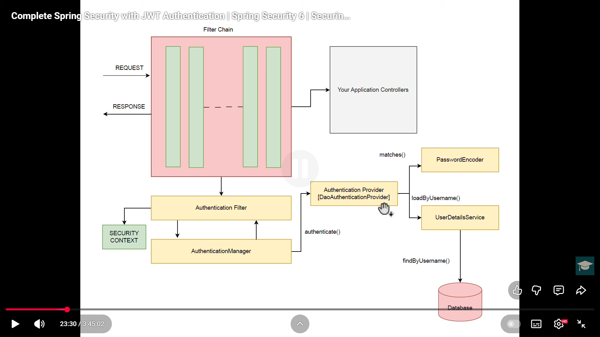

# Basic auth
# Bearer token 
Basically server side only session

# JWT
Stateless cryptographic verification by hasing payload header with server-known-only secret 
(which may not be used to decrypt but to compare (the same way that passwords are just compared with salt + pepper but not decrypted))

# Refresh token
Have a refresh token that works as a session and a auth token that is a short lived JWT.

# Resources
https://stackoverflow.com/questions/76092974/how-to-implement-securityconfig-in-java-spring-for-jwt-token-validation
https://www.youtube.com/watch?v=GH7L4D8Q_ak
https://www.youtube.com/watch?v=oeni_9g7too

https://developer.okta.com/blog/2019/08/22/okta-authjs-pkce

https://stackoverflow.com/questions/66660840/cannot-get-cookies-in-java-spring-boot-angular-application
https://www.reddit.com/r/webdev/comments/1ck3idf/are_jwt_refresh_tokens_structured_the_same_way_as/